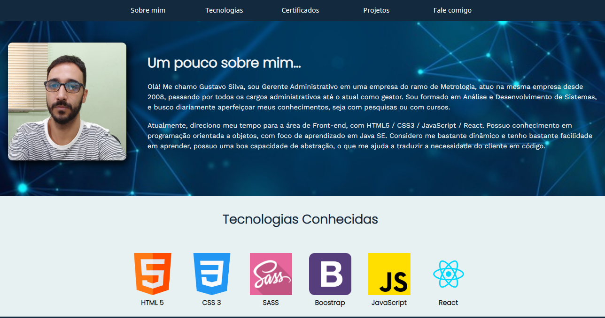

<h1>Portfolio Profissional</h1>

<h3>Projeto</h3>

Portfólio profissional para apresentação dos projetos realizados e tecnologias conhecidas e demonstração dos conhecimentos obtidos.

<h3>Acesse o projeto</h3><a href="https://gustavocrs.github.io/portfolio/">Clique Aqui</a> 

<h3>Linguagens</h3>

 
 

<h3>Autor</h3> Gustavo Silva

<h3>Imagens do projeto</h3>

